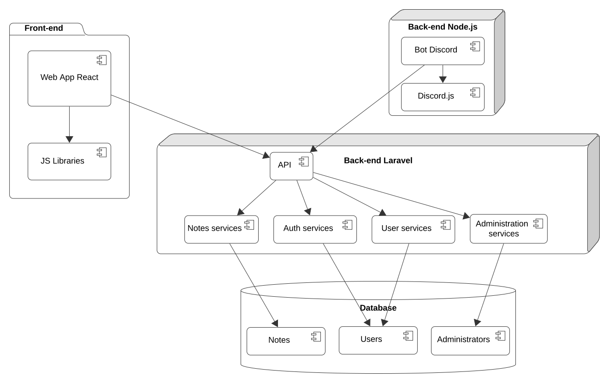
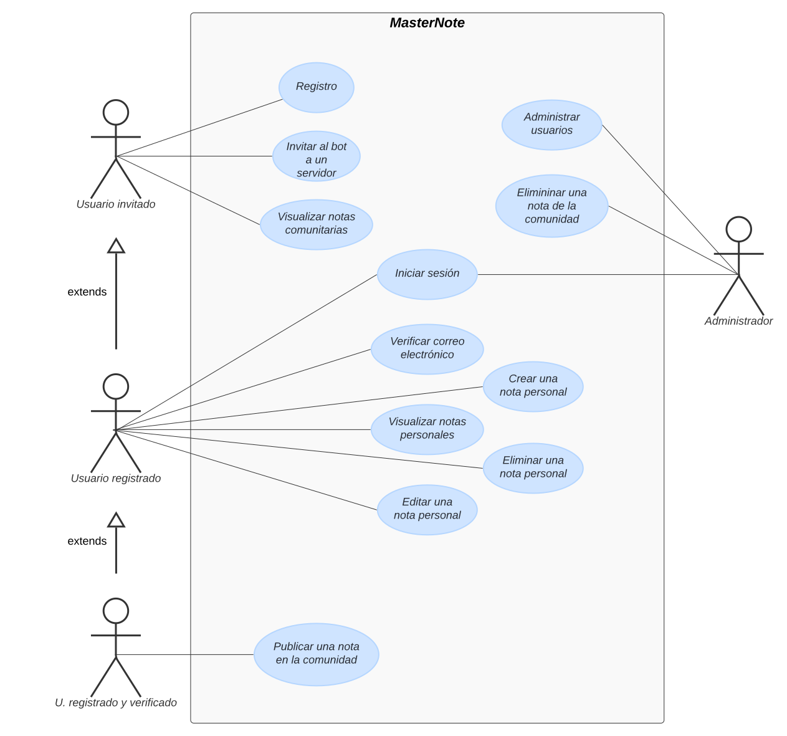
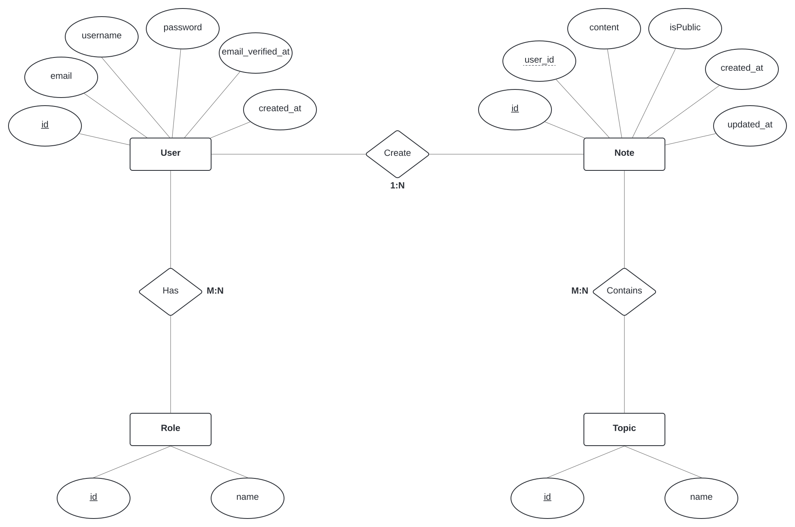

# Fase de diseño

- [Fase de diseño](#fase-de-diseño)
  - [1- Diagrama de arquitectura](#1--diagrama-de-arquitectura)
  - [2- Casos de uso](#2--casos-de-uso)
  - [3- Diagrama de Base de Datos](#3--diagrama-de-base-de-datos)
  - [4- Diseño de interfaces de usuarios](#4--diseño-de-interfaces-de-usuarios)

## 1- Diagrama de arquitectura

## 2- Casos de uso

## 3- Diagrama de Base de Datos

### Diagrama Entidad-Relación

### Diagrama Relacional

Ciertas entidades de la base de datos que son requeridas para el correcto funcionamiento del Framework, en particular aquellas relacionadas con la gestión de la arquitectura interna, no están representadas en los diagramas proporcionados.

## 4- Diseño de interfaces de usuarios

## Enlace al prototipo de la aplicación

[Figma - Prototipo](https://www.figma.com/file/XlZOYGJrZ836MshdTVzDhA/MasterNote-Web-App-Prototype?type=design&node-id=1%3A8&mode=design&t=KnnYLBzUuzHGFlal-1)
